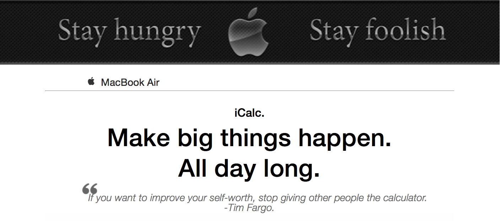
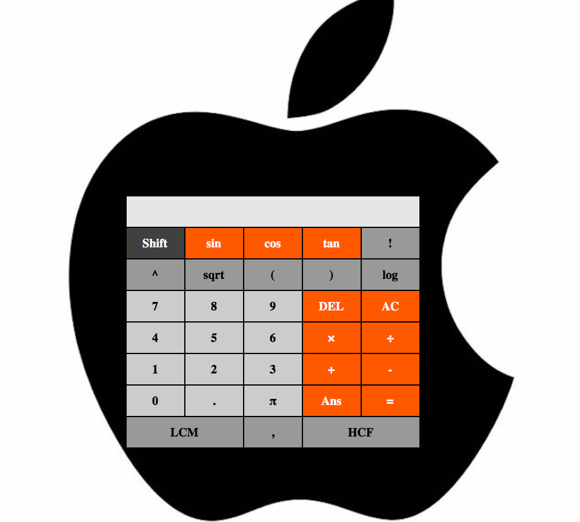

# iCalc
My tribute to Apple : A fully functional Mac-themed scientific calculator

## Why ?
Last Sunday, I was watching the movie "**Jobs**", the 2013 biographical movie on **Steve Jobs**, the man behind Apple. Not that I didn't expect that, but I was awestruck by the mind behind the glittery success the world sees.
**Ashton Kutcher** did a phenomenal work, as he stepped into the shoes of this eccentric genius.

Me, being an ardent Apple fan, thought of giving a sort of tribute to the wonderful dream facilitated by Steve and Woz.
Hence, iCalc.

## What is it ?
It is a a Mac-themed scientific calculator, designed to smoothly suit your needs. The user interface is pretty simple, and decent, with black and white shades soothing your conscience.

## Features

* Uses **BODMAS** rule for solving complex operations.
* **HCF** and **LCM**   
* **Trigonometric Functions** and **Inverse Trigonometric Functions** are supported.
* **Logarithm** (base 10 and base e)
* **Factorial**
* **Answer** can be stored and used later

## Usage

* Click on Shift to access a different set of functions, namely the inverse trigonometric functions, the natural logarithm, and the constant e.
* For finding out the HCF or LCM of two numbers, write **"first number,second number"** on the screen and then press HCF or LCM.
* For more than two numbers, take any two numbers,find there LCM or HCF (say it is x), now write **"x,next number"** on the screen and press LCM or HCF. And so on.

## Issues

This is a fairly new project. I am planning to implement few more functions. Do not hesitate to raise issues and possible enhancements. 

**Have fun..!!** 
